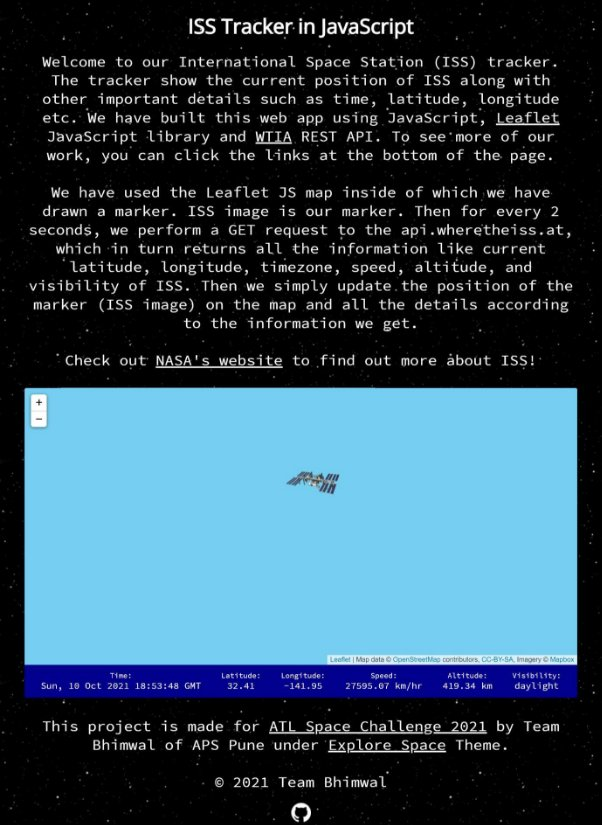
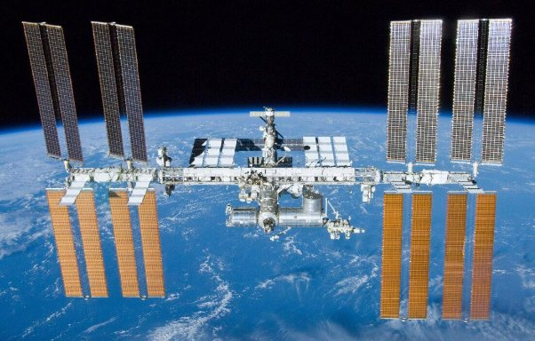
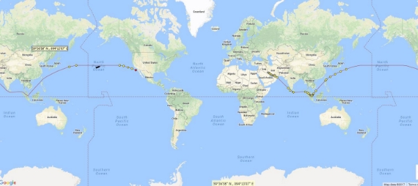
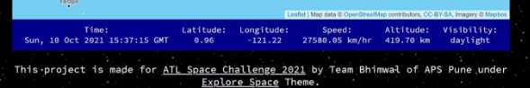
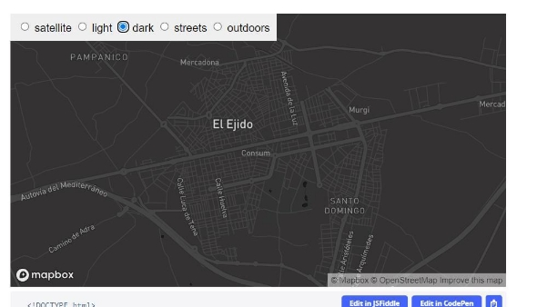

### ATL SPACE CHALLENGE 2021

**ACADEMIC YEAR: 2021-22** 

**PROJECT REPORT ON ISS-TRACKER** 

**STUDENT NAMES :** ISHAAN BHIMWAL, AYANNA BHIMWAL

**TEAM NAME :** TEAM BHIMWAL

**THEME :** EXPLORE SPACE

**TOPIC :** APP DEVELOPMENT

**SCHOOL :** ARMY PUBLIC SCHOOL PUNE

**PROJECT GUIDE:** MS SUJATA CHILLARA, PGT (CHEMISTRY), ARMY PUBLIC SCHOOL PUNE 

### ISS-TRACKER

Web app: https://ishaanbhimwal.github.io/ISS-Tracker

### INTRODUCTION ABOUT THE ISS

The International Space Station is a large spacecraft in orbit around Earth. It serves as a home where crews of astronauts and cosmonauts live. Several nations worked together to build and use the space station. The space station flies at an average altitude of 248 miles (400 kilo meters) above Earth. It circles the globe every 90 minutes at a speed of about 17,500 mph (28,000 km/h).

### TRACKING THE ISS

This project could help students both develop and work on making use-friendly applications that can help track and visualize satellites in real-time and map their path to retrieve important data. Data such as this can be later use in many areas such as predicting the spotting of ISS over a particular region on a particular time period. This project uses a Web API to find out the current location of the International Space Station (ISS) and plot its location on a map. 

### OBJECTIVES OF THE PROJECT

The objective of this project is to let the students apply the programming knowledge into a real-world situation/problem and expose the students how programming skills helps in developing a good software. 

- Write programs utilizing modern software tools. 
- Apply  object-oriented  programming  principles  effectively  when  developing small to medium sized projects. 
- Write effective procedural code to solve small to medium sized problems. 
- Students will demonstrate a breadth of knowledge in subjects like information practices,  as  exemplified  in  the  areas  of  systems,  theory  and  software development. 
- Students will demonstrate ability to conduct research or applied Information practices  project,  requiring  writing  and  presentation  skills  which  exemplify scholarly style in information practices. 

### WORKING

The tracker shows the current position of ISS along with other important details such as time, latitude, longitude etc. We have built this web app using JavaScript, Leaflet JavaScript library and WTIA REST API.  

First, we need a map. We have used the [Leaflet JS](https://leafletjs.com/examples/quick-start/) map.  

Next, we draw a marker. ISS image is our marker. 

Then for every 2 seconds, we perform a GET request to the [api.wheretheiss.at](https://api.wheretheiss.at/v1/satellites/25544), which in turn returns all the information like current latitude, longitude, time-zone, speed, altitude, and visibility of ISS. Then we simply update the position of the marker (ISS image) on the map and all the details according to the information we get. 

Marker (ISS image) updates its position according to live stats from the API. This also updates the details on the main screen. 

[See demo](https://user-images.githubusercontent.com/79986754/175538087-6d367eb8-221d-402a-9636-34ec0bacd447.mp4)

### FUTURE IMPROVEMENTS

We would like to at some point extend this app’s functionality to predict the spotting of ISS over a particular area after taking user input.  

Also, we would like to add a feature that would let users’ toggle between light and dark mode for the map according to their preferences. 

